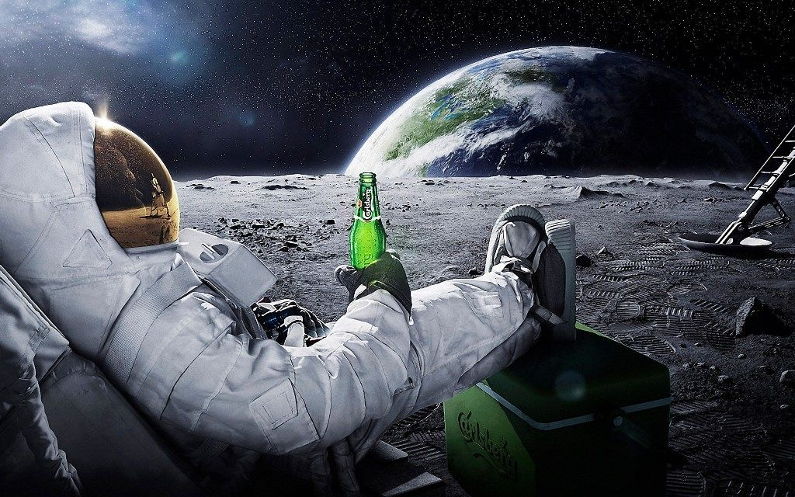

# Cerule - A <span style="color: #4285F4;">Tiny</span> <span style="color: #DB4437;">Mighty</span> <span style="color: #F4B400;">Vision</span> <span style="color: #0F9D58;">Model</span>
### Based on Google's - <span style="color: #D56c76;">Gemma-2b + SigLIP</span>


```
 ██████╗███████╗██████╗ ██╗   ██╗██╗     ███████╗
██╔════╝██╔════╝██╔══██╗██║   ██║██║     ██╔════╝
██║     █████╗  ██████╔╝██║   ██║██║     █████╗  
██║     ██╔══╝  ██╔══██╗██║   ██║██║     ██╔══╝  
╚██████╗███████╗██║  ██║╚██████╔╝███████╗███████╗
 ╚═════╝╚══════╝╚═╝  ╚═╝ ╚═════╝ ╚══════╝╚══════╝                                                               
 ```                                                               


We train and release "Cerule", a tiny yet powerful Vision Lanuage Model based on the newly released Google's [Gemma-2b](https://huggingface.co/google/gemma-2b) and Google's [SigLIP](https://huggingface.co/google/siglip-so400m-patch14-384). 

We utilise highly efficient data selection techniques with:
```
- Pretraining stage : 650K images (A LAION 2M Subset)
- Finetuning stage : 695K images (SVIT-mix-665K modified for finetuning(Dataset SOON!))
```
The training setup was `4xA100's 80GB` and took ~6 hours to pretrain and ~13 hours to finetune. We modify and adapt the training code from [LLaVA](https://github.com/haotian-liu/LLaVA). 

🚨 Training code, Data and more details to release soon!


---
| Image | Example |
|-------|---------|
|  | **Describe the image**<br>The image is a playful and surreal depiction of a man in a space suit, sitting on a chair and holding a green beer bottle. The man is wearing a white space suit, complete with a helmet and gloves. His feet are clad in black and white shoes, and he is placed on a sandy surface. The background features a large, blue planet, with a moon and a star visible in the sky. |
|  | **Who are the characters in the image?**<br>The image features three characters, two of them are Mario and Luigi, and the third one is Yoshi.<br><br>**Describe the actions of the characters**<br>The Mario and Luigi characters are holding their arms out, as if they are waving. Yoshi is standing on its own, with its arms folded. |
|  | **What's funny about this image?**<br>The image is quite humorous as it depicts a man ironing clothes on the back of a yellow taxi cab. This is not a typical sight you'd expect to see in everyday life. |
---


### Training:
We will release the training code in some time.

### Inference:
Before running the snippet, you need to install the following dependencies:

```
pip install --upgrade pip
pip install transformers
pip install torch torchvision xformers --index-url https://download.pytorch.org/whl/cu118
```
```
pip install ninja
git clone https://github.com/NVIDIA/apex
cd apex
pip install -v --disable-pip-version-check --no-cache-dir --no-build-isolation --global-option="--cpp_ext" --global-option="--cuda_ext" ./
# https://github.com/Dao-AILab/flash-attention?tab=readme-ov-file#installation-and-features
```
```
pip install packaging
pip install flash-attn --no-build-isolation
git clone https://github.com/Tensoic-AI/Cerule
cd Cerule
pip install -e .
```

For CLI-based inference:
```
python3 -m cerule.serve.cli \
	--model-path /path/to/cerule/model \
	--model-type gemma \
	--image-file examples/astronaut.png
```

--- 

*The below code might break! Please use the CLI based inference in the meantime*
```python
import torch
import transformers
from transformers import AutoModelForCausalLM, AutoTokenizer
from PIL import Image
import warnings

transformers.logging.set_verbosity_error()
transformers.logging.disable_progress_bar()
warnings.filterwarnings('ignore')

torch.set_default_device('cuda')  # or 'cpu'

model = AutoModelForCausalLM.from_pretrained(
    'Tensoic/Cerule',
    torch_dtype=torch.float16,
    device_map='auto',
    trust_remote_code=True)
tokenizer = AutoTokenizer.from_pretrained(
    'Tensoic/Cerule',
    trust_remote_code=True)

# text prompt
prompt = 'Who are these charecters?'
text = f"A chat between a curious user and an artificial intelligence assistant. The assistant gives helpful, detailed, and polite answers to the user's questions. USER: <image>\n{prompt} ASSISTANT:"
text_chunks = [tokenizer(chunk).input_ids for chunk in text.split('<image>')]
input_ids = torch.tensor(text_chunks[0] + [-200] + text_chunks[1], dtype=torch.long).unsqueeze(0)

image = Image.open('examples/mario.png')
image_tensor = model.process_images([image], model.config).to(dtype=model.dtype)

# generate
output_ids = model.generate(
    input_ids,
    images=image_tensor,
    max_new_tokens=100,
    use_cache=False)[0] #keep use_cache=False or else it might run into some torch dim error

print(tokenizer.decode(output_ids[input_ids.shape[1]:], skip_special_tokens=False).strip())
```

## License
Apache 2.0? Maybe... idk
